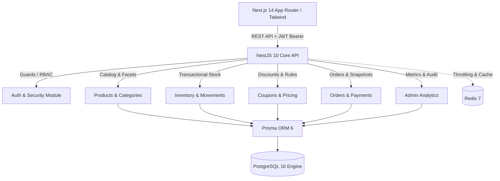

# 🛍️ Wally Commerce — Plataforma E-Commerce Full Stack Enterprise

Plataforma de comercio electrónico moderna, modular, altamente escalable y segura inspirada en los estándares de experiencia de usuario y arquitectura de **Amazon, Treinta y Zara**.

---

## 🏗️ 1. Arquitectura y Tecnologías

El proyecto está diseñado bajo un patrón de **Monolito Modular** y **Domain-Driven Design (DDD)**, separando estrictamente responsabilidades entre Frontend, Backend y Base de Datos.



### Stack Tecnológico:
* **Frontend**: Next.js 14 (App Router), React 18, TypeScript, Tailwind CSS, Zustand, Lucide Icons, Axios.
* **Backend**: NestJS 10, TypeScript, Prisma ORM 6, Passport JWT, Argon2id, Class-Validator, Swagger (OpenAPI 3.0), Helmet.
* **Base de Datos & Cache**: PostgreSQL 16 (Normalizada con índices B-tree, JSONB y claves foráneas en cascada) y Redis 7.
* **DevOps**: Docker & Docker Compose (Multi-stage production builds).

---

## 🔑 2. Credenciales y Usuarios por Defecto (Seed)

| Rol | Correo Electrónico | Contraseña | Permisos |
| :--- | :--- | :--- | :--- |
| **Super Administrador** | `admin@wallystore.com` | `Admin123456!` | Acceso total al Panel Administrativo, métricas, CRUD de catálogo, inventario, pedidos y auditoría |
| **Cliente Demo** | `cliente@wallystore.com` | `Cliente123456!` | Compras en storefront, carrito persistente, seguimiento de órdenes y perfil |

### Cupones de Descuento Activos:
* **`BIENVENIDO10`**: 10% de descuento en la primera orden (mínimo \$50).
* **`WALLYVIP50`**: \$50 de descuento directo en compras mayores a \$300.

---

## 🚀 3. Inicio Rápido

### Opción A: Despliegue con Docker Compose (Recomendado)

1. Clona el repositorio e ingresa al directorio raíz:
   ```bash
   cd c:\Wally
   ```
2. Levanta todos los servicios:
   ```bash
   docker-compose up --build -d
   ```
3. Ejecuta las migraciones y el seeder inicial:
   ```bash
   docker-compose exec backend npx prisma migrate deploy
   docker-compose exec backend npm run prisma:seed
   ```
4. Accede a las aplicaciones:
   * **Tienda (Storefront)**: [http://localhost:3000](http://localhost:3000)
   * **Panel Administrativo**: [http://localhost:3000/admin/login](http://localhost:3000/admin/login)
   * **API Backend**: [http://localhost:4000/api/v1](http://localhost:4000/api/v1)
   * **Swagger Docs**: [http://localhost:4000/api/docs](http://localhost:4000/api/docs)

---

### Opción B: Ejecución Manual en Entorno Local

#### 1. Backend:
```bash
cd c:\Wally\backend
npm install
npx prisma generate
npm run prisma:seed
npm run start:dev
```
*API iniciará en el puerto 4000.*

#### 2. Frontend:
```bash
cd c:\Wally\frontend
npm install
npm run dev
```
*Tienda iniciará en el puerto 3000.*

---

## 🧪 4. Pruebas Automatizadas

Para ejecutar la suite completa de pruebas unitarias de seguridad y lógica de negocio:

```bash
cd c:\Wally\backend
npm test
```

---

## 📂 5. Estructura del Repositorio

```
Wally/
├── backend/                  # API NestJS 10 + Prisma ORM
│   ├── prisma/
│   │   ├── schema.prisma     # 20+ Modelos de Base de Datos
│   │   └── seed.ts           # Seeder idempotente con catálogo y usuarios
│   ├── src/
│   │   ├── common/           # Decoradores, Guards, Interceptores, Filtros
│   │   ├── database/         # Prisma Service
│   │   └── modules/          # Auth, Categories, Brands, Products, Inventory, Coupons, Cart, Orders, Admin
│   ├── Dockerfile
│   └── package.json
│
├── frontend/                 # Storefront & Admin en Next.js 14
│   ├── src/
│   │   ├── app/              # App Router (/, /products, /cart, /checkout, /account, /admin)
│   │   ├── components/       # Design System UI & Componentes E-Commerce
│   │   ├── lib/              # Axios API Client & Helpers
│   │   ├── store/            # Zustand Stores (Cart, Auth)
│   │   └── types/            # TypeScript Interfaces
│   ├── Dockerfile
│   └── package.json
│
├── docker-compose.yml        # Orquestación Postgres + Redis + Backend + Frontend
├── API_DOCUMENTATION.md      # Catálogo exhaustivo de endpoints REST
└── DEPLOYMENT_GUIDE.md       # Guía de despliegue en Servidores y Nube
```
